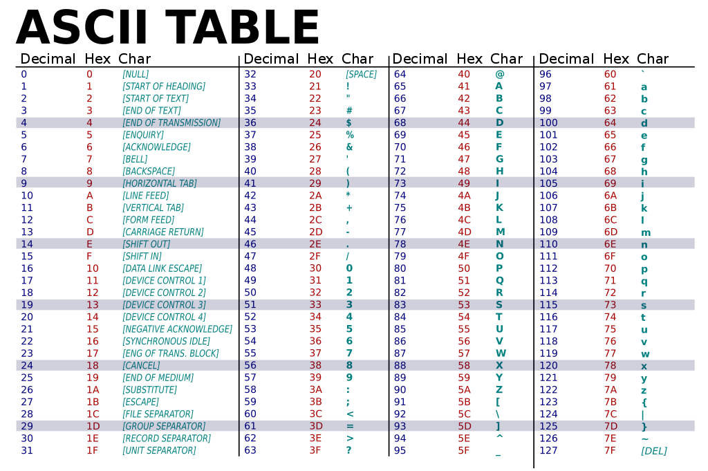
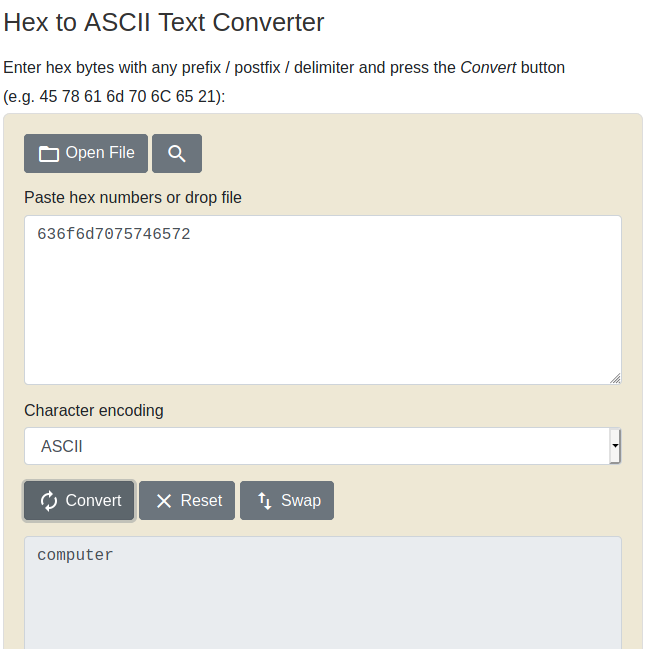

# [PicoCTF](./picoctf.md) PicoGym General Skills

This section introduces some basic Unix commands, base encoding and the mechanics of CTF exercises.

## Contents

- [Useful References](#useful-references)
- [2Warm](#two-warm)
- [Warmed Up](#warmed-up)
- [Lets Warm Up](#lets-warm-up)
- [strings it](#strings-it)
- [Bases](#bases)
- [First Grep](#first-grep)
- [what's a net cat?](#whats-a-net-cat)
- [plumbing](#plumbing)
- [Based](#based)
- [flag_shop](#flag-shop)
- [mus1c](#mus1c)
- [1_wanna_b3_a_r0ck5tar](#i-wanna-b3-a-r0ck5tar)

---

### [General Skills](#contents) | [PicoCTF](./picoctf.md) | [Home](./index.md)

---

## Useful References

| Link | Description |
|------|-------------|
| [rapidtables.com](https://www.rapidtables.com/convert/number/index.html) | Number conversion tools. |
| [asciitable.com](http://www.asciitable.com/) | ASCII character table. |
| [strings wiki](https://en.wikipedia.org/wiki/Strings_(Unix)) | Unix strings command. |
| [grep wiki](https://en.wikipedia.org/wiki/Grep) | Unix grep command. |
| [base64decode.org](https://www.base64decode.org/) | Base64 decoder online tool. |
| [nc man page](https://linux.die.net/man/1/nc) | NetCat Linux man page. |
| [linfo pipes](http://www.linfo.org/pipe.html) | Linux information page on pipes. |
| [unit-conversion.info](http://www.unit-conversion.info/texttools/category/Converters) | Text tools - Converters. |
| [cppreference.com](https://en.cppreference.com/w/c/types/limits) | Data type 32-bit limits reference. |
| [codewithrockstar.com](https://codewithrockstar.com/) | Rockstar programming language homepage. |
| [rockstar-py](https://github.com/yyyyyyyan/rockstar-py) | Rockstar python transpiler. |

---

### [General Skills](#contents) | [PicoCTF](./picoctf.md) | [Home](./index.md)

---

## two-warm

- Author: Sanjay C/Danny Tunitis
- 50 Points

### Description

Can you convert the number 42 (base 10) to binary (base 2)? 

### Hints

1. Submit your answer in our competition's flag format. For example, if your answer was '11111', you would submit 'picoCTF{11111}' as the flag.

### Solutions

Solution 1

This problem can be solved with basic maths and an understanding of number bases.  We have a base-10 number (decimal) we wish to convert to a base-2 number (binary):

$$42_{10} = x_2$$

To convert by hand, we can divide the decimal number by the base we wish to convert it to and record the remainder.  This iterative process will return the binary number starting at the smallest index. This can be easily recorded against the binary index in a table:

$$\frac{42}{2} = 21 \mathrm{, r } (0)$$

We can record this against the first binary index:

| binary index | 64 | 32 | 16 | 8 | 4 | 2 | 1 |
|--------------|----|----|----|---|---|---|---|
| bin(42)      |  ? |  ? |  ? | ? | ? | ? | 0 |

We repeat with the result of the division:

$$\frac{21}{2} = 10 \mathrm{, r } (1)$$

| binary index | 64 | 32 | 16 | 8 | 4 | 2 | 1 |
|--------------|----|----|----|---|---|---|---|
| bin(42)      |  ? |  ? |  ? | ? | ? | 1 | 0 |

And again:

$$\frac{10}{2} = 5 \mathrm{, r } (0)$$

| binary index | 64 | 32 | 16 | 8 | 4 | 2 | 1 |
|--------------|----|----|----|---|---|---|---|
| bin(42)      |  ? |  ? |  ? | ? | 0 | 1 | 0 |

We keep doing this until the integer result is 0:

$$\frac{5}{2} = 2 \mathrm{, r } (1)$$

| binary index | 64 | 32 | 16 | 8 | 4 | 2 | 1 |
|--------------|----|----|----|---|---|---|---|
| bin(42)      |  ? |  ? |  ? | 1 | 0 | 1 | 0 |

$$\frac{2}{2} = 1 \mathrm{, r } (0)$$

| binary index | 64 | 32 | 16 | 8 | 4 | 2 | 1 |
|--------------|----|----|----|---|---|---|---|
| bin(42)      |  ? |  ? |  0 | 1 | 0 | 1 | 0 |

$$\frac{1}{2} = 0 \mathrm{, r } (1)$$

| binary index | 64 | 32 | 16 | 8 | 4 | 2 | 1 |
|--------------|----|----|----|---|---|---|---|
| bin(42)      |  0 |  1 |  0 | 1 | 0 | 1 | 0 |

Our binary number is: 101010, the flag is therefore:

~~~
picoCTF{101010}
~~~

Solution 2

Solving by hand is easy with small numbers, when we have a series or very large decimal integers, it is easier to decode and encode numbers using a script.

In Python, a decimal can be converted into a binary number using the native command, bin():

~~~py
In [1]: bin(42)
Out[1]: '0b101010'
~~~

This returns a character string with the binary translated number.  Python indicates the number is binary with the '0b' character at the beginning of the binary string.  This can be verified using the in-built Python type() function:

~~~py
In [2]: type(bin(42))
Out[2]: str
~~~

Our binary number is: 101010, the flag is therefore:

~~~
picoCTF{101010}
~~~

Solution 3

The simplest method to solve this problem is to use an online decoder/encoder tool such as the ones found on [rapidtables.com](https://www.rapidtables.com/convert/number/decimal-to-binary.html?x=42).  This provides the answer without requiring any strenuous thinking:

Our binary number is: 101010, the flag is therefore:

~~~
picoCTF{101010}
~~~

### Answer

Flag

~~~
picoCTF{101010}
~~~

---

### [General Skills](#contents) | [PicoCTF](./picoctf.md) | [Home](./index.md)

---

## Warmed Up

- Author: Sanjay C/Danny Tunitis
- 50 points

### Description

What is 0x3D (base 16) in decimal (base 10)?

### Hints

1. Submit your answer in our flag format. For example, if your answer was '22', you would submit 'picoCTF{22}' as the flag.

### Solutions

Solution 1

Base 16, also known as hex, is a numerical system employed in computer programmes.  Hex provides a simplifcation of Byte data (8-bits) into a simple 2-character representation.

Solving this problem by hand is a lot more difficult.  base16 numbers extend beyond the traditional numerical ascii characters since it is a larger base than base 10.  The index is defined in the table below:

| base 16 | 0 | 1 | 2 | 3 | 4 | 5 | 6 | 7 | 8 | 9 | A  | B  | C  | D  | E  | F  |
|---------|---|---|---|---|---|---|---|---|---|---|----|----|----|----|----|----|
| base 10 | 0 | 1 | 2 | 3 | 4 | 5 | 6 | 7 | 8 | 9 | 10 | 11 | 12 | 13 | 14 | 15 |

We can solve this using lookup tables.  The second index of base 16 can be described as below:

| base 16 | 00 | 10 | 20 | 30 | 40 | 50 | 60 | 70  | 80  | 90  | A0  | B0  | C0  | D0  | E0  | F0  |
|---------|----|----|----|----|----|----|----|-----|-----|-----|-----|-----|-----|-----|-----|-----|
| base 10 | 00 | 16 | 32 | 48 | 64 | 80 | 96 | 112 | 128 | 144 | 160 | 176 | 192 | 208 | 224 | 240 |

This problem can be solved by breaking the hex number into its consituent parts:

$$ 3D_{16} = 30_{16} + D_{16} $$

We can lookup both values and calculate the decimal number:

$$ 30_{16} + D_{16} = 48_{10} + 13_{10} = 61_{10} $$ 

The decimal number is 61, the flag is therefore:

~~~
picoCTF{61}
~~~

Solution 2

Alternatively, we can use a simple program to convert this into a decimal number.  iPython will convert a hex number into decimal using the defined "0x" notation:

~~~py
In [0]: 0x3d
Out[0]: 61
~~~

The decimal number is 61, the flag is therefore:

~~~
picoCTF{61}
~~~

Solution 3

Without any thinking, this can be solved using an online coversion tool such as [rapidtables.com](https://www.rapidtables.com/convert/number/hex-to-decimal.html?x=3D):

The decimal number is 61, the flag is therefore:

~~~
picoCTF{61}
~~~

### Answer

Flag

~~~
picoCTF{61}
~~~

---

### [General Skills](#contents) | [PicoCTF](./picoctf.md) | [Home](./index.md)

---

## Lets Warm Up

- Author: Sanjay C/Danny Tunitis
- 50 points

### Description

If I told you a word started with 0x70 in hexadecimal, what would it start with in ASCII? 

### Hints

1. Submit your answer in our flag format. For example, if your answer was 'hello', you would submit 'picoCTF{hello}' as the flag.

### Solutions

Solution 1

This can be solved by hand using an ascii lookup table:

The hex number 0x70 corresponds to 112 in decimal.  Using the lookup table, we can see that this corresponds to the ascii character, 'p'.

~~~
picoCTF{p}
~~~

Solution 2

Using Python, the ascii value of 0x70 can be found using a simple command:

~~~py
In [0]: '\x70'
Out[0]: 'p'
~~~

The flag is therefore:

~~~
picoCTF{p}
~~~

Solution 3

This can be solved using an online conversion tool such as [rapidtables.com](https://www.rapidtables.com/convert/number/hex-to-ascii.html):

This gives us the ascii character "p" resulting in the flag:

~~~
picoCTF{p}
~~~

### Answer

Flag

~~~
picoCTF{p}
~~~

---

### [General Skills](#contents) | [PicoCTF](./picoctf.md) | [Home](./index.md)

---

## strings it

- Author: Sanjay C/Danny Tunitis
- 100 points

### Description

Can you find the flag in file without running it?

### Hints

1. [strings](https://linux.die.net/man/1/strings)

### Attachments

[strings](./resources/picoctf/picogym/attachments/general-skills/strings-it/strings)

### Solutions

Solution 1

This problem is suggesting we should use the Unix in-built program, [strings](https://en.wikipedia.org/wiki/Strings_(Unix)).  This provides a list of all text strings within a binary file:

~~~shell
$ strings strings
~~~

Using strings on its own results in a long list of ascii strings which can be manually reviewed for the flag.  A more sensible solution, however, is to use a second in-built Unix program, [grep](https://en.wikipedia.org/wiki/Grep).

~~~shell
$ strings strings | grep pico
picoCTF{5tRIng5_1T_7f766a23}
~~~

This gives us the flag:

~~~
picoCTF{5tRIng5_1T_7f766a23}
~~~

### Answer

Flag

~~~
picoCTF{5tRIng5_1T_7f766a23}
~~~

---

### [General Skills](#contents) | [PicoCTF](./picoctf.md) | [Home](./index.md)

---

## Bases

- Author: Sanjay C/Danny T
- 100 points

### Description

What does this bDNhcm5fdGgzX3IwcDM1 mean? I think it has something to do with bases.

### Hints

1. Submit your answer in our flag format. For example, if your answer was 'hello', you would submit 'picoCTF{hello}' as the flag.

### Solutions

Solution 1

This problem provides an encoded flag for us to resolve:

~~~
bDNhcm5fdGgzX3IwcDM1
~~~

There are many encoding bases used in computation including binary (base 2), octal (base 8), decimal (base 10), hex (base 16), base 32 and base 64.  These are the most common encoding bases.

Reviewing the encoded flag, we can see it includes both numerals and letters.  This suggests that it must be encoded with a base greater than 10.

Similarly, the encoded flag has letters beyond f, in this case it includes the letter z.  It is therefore not encoded in hexadecimal.  Base 32 employs letters and numerals to represent a digit however it only uses one set of letters (lower case or upper case depending on the version).  The flag, as is seen, has both upper and lower case letters (m and M for example).  It would therefore be sensible to assume it is encoded in base64.

We can attempt the decoding in Python using the base64 library:

~~~py
In [0]: import base64 as b64

In [1]: str64 = 'bDNhcm5fdGgzX3IwcDM1'

In [2]: b64.b64decode(str64)
Out[2]: b'l3arn_th3_r0p35'
~~~

This provides an ascii string; "l3arn_th3_r0p35" which leads us to the flag:

~~~
picoCTF{l3arn_th3_r0p35}
~~~

Solution 2

This can be solved using an online base 64 decoder such as [base64decode.org](https://www.base64decode.org/):

 

This provides an ascii string; "l3arn_th3_r0p35" which leads us to the flag:

~~~
picoCTF{l3arn_th3_r0p35}
~~~

### Answer

Flag

~~~
picoCTF{l3arn_th3_r0p35}
~~~

---

### [General Skills](#contents) | [PicoCTF](./picoctf.md) | [Home](./index.md)

---

## First Grep

- Author: Alex Fulton/Danny Tunitis
- 100 points

### Description

Can you find the flag in file? This would be really tedious to look through manually, something tells me there is a better way.

### Hints

1. grep [tutorial](https://ryanstutorials.net/linuxtutorial/grep.php).

### Attachments

[file](./resources/picoctf/picogym/attachments/general-skills/first-grep/file)

### Solutions

Solution 1

This problem is suggesting we should use the Unix in-built program, [strings](https://en.wikipedia.org/wiki/Strings_(Unix)).  This provides a list of all text strings within a binary file:

~~~shell
$ strings file
~~~

Using strings on its own results in a long list of ascii strings which can be manually reviewed for the flag.  A more sensible solution, however, is to use a second in-built Unix program, [grep](https://en.wikipedia.org/wiki/Grep).

~~~shell
$ strings file | grep pico
picoCTF{grep_is_good_to_find_things_5af9d829}
~~~

This gives us the flag:

~~~
picoCTF{grep_is_good_to_find_things_5af9d829}
~~~

### Answer

Flag

~~~
picoCTF{grep_is_good_to_find_things_5af9d829}
~~~

---

### [General Skills](#contents) | [PicoCTF](./picoctf.md) | [Home](./index.md)

---

## what's a net cat?

- Author: Sanjay C/Danny Tunitis
- 100 points

### Description

Using netcat (nc) is going to be pretty important. Can you connect to jupiter.challenges.picoctf.org at port 41120 to get the flag?

### Hints

1. nc [tutorial](https://linux.die.net/man/1/nc).

### Solutions

Solution 1

This is a very simple problem.  The flag is given when connecting to the host jupiter.challenges.picoctf.org on port 41120.

This can be completed using netcat:

~~~shell
$ nc jupiter.challenges.picoctf.org 41120
You're on your way to becoming the net cat master
picoCTF{nEtCat_Mast3ry_3214be47}
~~~

Or using telnet:

~~~shell
$ telnet jupiter.challenges.picoctf.org 41120
Trying 3.131.60.8...
Connected to jupiter.challenges.picoctf.org.
Escape character is '^]'.
You're on your way to becoming the net cat master
picoCTF{nEtCat_Mast3ry_3214be47}
Connection closed by foreign host.
~~~

Or even in a browser:

 

### Answer

Flag

~~~
picoCTF{nEtCat_Mast3ry_3214be47}
~~~

---

### [General Skills](#contents) | [PicoCTF](./picoctf.md) | [Home](./index.md)

---

## plumbing

- Author: Alex Fulton/Danny Tunitis
- 200 points

### Description

Sometimes you need to handle process data outside of a file. Can you find a way to keep the output from this program and search for the flag? Connect to jupiter.challenges.picoctf.org 4427.

### Hints

1. Remember the flag format is picoCTF{XXXX}.
2. What's a pipe? No not that kind of pipe... This [kind](http://www.linfo.org/pipes.html).

### Solutions

Solution 1

This problem requires the use of netcat and grep.  Using netcat to access the remote host, results in an extended print of information including the flag.  Grep allows us to quickly and simply locate the flag and ignore the excess information:

Using netcat:

~~~shell
$ nc jupiter.challenges.picoctf.org 4427 | grep pico
picoCTF{digital_plumb3r_5ea1fbd7}
~~~

Using telnet:

~~~shell
$ telnet jupiter.challenges.picoctf.org 4427 | grep pico
Connected to jupiter.challenges.picoctf.org.
picoCTF{digital_plumb3r_5ea1fbd7}
Connection closed by foreign host.
~~~

### Answer

Flag

~~~
picoCTF{digital_plumb3r_5ea1fbd7}
~~~

---

### [General Skills](#contents) | [PicoCTF](./picoctf.md) | [Home](./index.md)

---

## Based

- Author: Alex Fulton/Daniel Tunitis
- 200 points

### Description

To get truly 1337, you must understand different data encodings, such as hexadecimal or binary. Can you get the flag from this program to prove you are on the way to becoming 1337? Connect with nc jupiter.challenges.picoctf.org 29956.

### Hints

1. I hear python can convert things.
2. It might help to have multiple windows open.

### Solutions

Solution 1

This challenge requires rapid conversion of encoded strings into ascii.  When connecting using netcat the following is displayed:

~~~shell
$ nc jupiter.challenges.picoctf.org 29956  
Let us see how data is stored
lamp
Please give the 01101100 01100001 01101101 01110000 as a word.
...
you have 45 seconds.....

Input:
~~~

Using online conversion tools, we can complete this challenge with relative ease.  The string in the first question is encoded as a binary array and can be converted into ascii using an online binary to ascii conversion tool, such as [rapidtables.com](https://www.rapidtables.com/convert/number/binary-to-ascii.html)

 

we can manually enter lamp into the netcat session:

~~~shell
Input:
lamp
Please give me the  155 141 160 as a word.
Input:
~~~

The next question is encoded in numerical digits 155, 141, 160.  Reviewing the ascii lookup table we can see this is not decimal.  Similarly, we can assume it is not hex, binary or base64 from the simplicity of the encoded values.  A review of an extended ascii table suggests that it is most likely encoded in octal:

 

An online conversion tool can be used for octal to ascii such as found at [unit-conversion.info](http://www.unit-conversion.info/texttools/octal/):

 

This gives us map, which can be manually entered into the terminal:

~~~shell
Input:
map
Please give me the 636f6d7075746572 as a word.
Input:
~~~

The final question provides a string with both numeric and alphabetic characters: 636f6d7075746572.  This is most likely a hex string and can be converted using a hex to ascii conversion tool such as found at [rapidtables.com](https://www.rapidtables.com/convert/number/hex-to-ascii.html):

 

This gives us the final string, computer, which can be manually entered into the terminal:

~~~shell
Input:
computer
You've beaten the challenge
Flag: picoCTF{learning_about_converting_values_b375bb16}
~~~

The remote program responds with the flag:

~~~
Flag: picoCTF{learning_about_converting_values_b375bb16}
~~~

Solution 2

This challenge can be completed using simple programming techniques and libraries available on Python:

based.py

 
~~~py
"""
@author: djm89uk

picoCTF picoGym general skills challenge, "based"

based.py
"""
import socket

hostname = "jupiter.challenges.picoctf.org"
port = 29956

sock = socket.socket(socket.AF_INET, socket.SOCK_STREAM)
sock.connect((hostname, port))

data = sock.recv(1024)
data = data.decode()

q_start = data.find("give the ") + 9
q_end = data.find("as a word")-1

bstr = data[q_start:q_end]
barr = bstr.split(" ")

str1 = ''

for letter in barr:
    str1 += (chr(int(letter,2)))
print(bstr + " = " + str1)
sock.send(str1.encode())
sock.send(("\n").encode())
data = sock.recv(1024)
data = data.decode()

q_start = data.find("give me the ") + 13
q_end = data.find("as a word")-1

bstr = data[q_start:q_end]
barr = bstr.split(" ")

str2 = ''

for letter in barr:
    str2 += (chr(int(letter,8)))
print(bstr + " = " + str2)
sock.send(str2.encode())
sock.send(("\n").encode())
data = sock.recv(1024)
data = data.decode()

q_start = data.find("give me the ") + 12
q_end = data.find("as a word")-1

bstr = data[q_start:q_end]
blen = int(len(bstr)/2)
barr = ['']*blen
intarr = ['']*blen
str3 = ''
for i in range (0,blen):
    barr[i] = bstr[2*i]+bstr[2*i+1]
    intarr[i] = int(barr[i],16)
    str3 += chr(intarr[i])
print(bstr + " = " + str3)
sock.send(str3.encode())
sock.send(("\n").encode())
data = sock.recv(1024)
data = data.decode()

flag_start = data.find("pico")
flag_end = data.find("}")+1
flag = data[flag_start:flag_end]
print("*"*20 + "\n"+flag+"\n"+"*"*20)

sock.close()
~~~

When run the following is output to the console:

~~~shell
In [0]: runfile('based.py')
01100011 01101111 01101101 01110000 01110101 01110100 01100101 01110010 = computer
146 141 154 143 157 156 = falcon
616e696d6174696f6e = animation
********************
picoCTF{learning_about_converting_values_b375bb16}
********************
~~~

### Answer

Flag

~~~
picoCTF{learning_about_converting_values_b375bb16}
~~~

---

### [General Skills](#contents) | [PicoCTF](./picoctf.md) | [Home](./index.md)

---

## flag-shop

- Author: Danny
- 400 points

### Description

There's a flag shop selling stuff, can you buy a flag? Source. Connect with nc jupiter.challenges.picoctf.org 9745.

### Hints

1. Two's compliment can do some weird things when numbers get really big!

### Attachments

store.c

~~~c
#include <stdio.h>
#include <stdlib.h>
int main()
{
    setbuf(stdout, NULL);
    int con;
    con = 0;
    int account_balance = 1100;
    while(con == 0){
        printf("Welcome to the flag exchange\n");
        printf("We sell flags\n");
        printf("\n1. Check Account Balance\n");
        printf("\n2. Buy Flags\n");
        printf("\n3. Exit\n");
        int menu;
        printf("\n Enter a menu selection\n");
        fflush(stdin);
        scanf("%d", &menu);
        if(menu == 1){
            printf("\n\n\n Balance: %d \n\n\n", account_balance);
        }
        else if(menu == 2){
            printf("Currently for sale\n");
            printf("1. Defintely not the flag Flag\n");
            printf("2. 1337 Flag\n");
            int auction_choice;
            fflush(stdin);
            scanf("%d", &auction_choice);
            if(auction_choice == 1){
                printf("These knockoff Flags cost 900 each, enter desired quantity\n");
                int number_flags = 0;
                fflush(stdin);
                scanf("%d", &number_flags);
                if(number_flags > 0){
                    int total_cost = 0;
                    total_cost = 900*number_flags;
                    printf("\nThe final cost is: %d\n", total_cost);
                    if(total_cost <= account_balance){
                        account_balance = account_balance - total_cost;
                        printf("\nYour current balance after transaction: %d\n\n", account_balance);
                    }
                    else{
                        printf("Not enough funds to complete purchase\n");
                    }
                }    
            }
            else if(auction_choice == 2){
                printf("1337 flags cost 100000 dollars, and we only have 1 in stock\n");
                printf("Enter 1 to buy one");
                int bid = 0;
                fflush(stdin);
                scanf("%d", &bid);
                if(bid == 1){
                    if(account_balance > 100000){
                        FILE *f = fopen("flag.txt", "r");
                        if(f == NULL){
                            printf("flag not found: please run this on the server\n");
                            exit(0);
                        }
                        char buf[64];
                        fgets(buf, 63, f);
                        printf("YOUR FLAG IS: %s\n", buf);
                        }
                    else{
                        printf("\nNot enough funds for transaction\n\n\n");
                    }}
            }
        }
        else{
            con = 1;
        }
    }
    return 0;
}
~~~

### Solutions

Solution 1

This challenge requires exploiting the maximum size of a 32-bit integer.   [cppreference.com](https://en.cppreference.com/w/c/types/limits) provides details on the maximum and minimum integer size:

| Limit   | Integer        |
|---------|----------------|
| Minimum | -2,147,483,648 |
| Maximum | +2,147,483,647 |

When we exceed these limits, we can expect the value to revert to the alternate limit.  E.g. 2,147,483,647+3 = -2,147,483,648.

Inspecting the source code, we can see two variables we need to manipulate, account_balance and total_cost.  By exceeding the maximum integer size in total_cost we can induce a negative cost.  We need to do this to maximise the account_balance so as to be able to afford the flag.

We start with an account balance of 1100.  Our balance after purchasing the "Definitely not the flag flag" can be calculated:

~~~
account_balance = 1100 - total_cost 
~~~

We need to exceed the integer threshold to minimise the total cost and maximise our account balance.  The total cost is calculated:

~~~
total_cost = 900*number_flags
~~~

To exceed the integer threshold, we need to purchase more than 2,386,092 flags:

~~~
2386092 * 900 > 2147483647
~~~

If we select 2,386,093 flags, the total cost is 2,147,483,700.  This exceeds the maximum integer threshold by 53.  The total_cost variable will be:

~~~
-2,147,483,648 + 53 - 1 = -2147483596
~~~

However, when this is taken from the account balance, we will again exceed the maximum threshold, resulting in a very low account balance, exceeding the threshold by 1049:

~~~
1100 + 2147483596 = 2147484696
                  = -2147483648 + 1049 - 1
                  = -2147482600
~~~

To avoid this, we need to ensure the account_balance does not exceed the maximum integer threshold:

~~~
1100 + 2147483596 -n*900 < 2147483647

-n*900 < 2147483647 -1100 -2147483596
-n*900 < -1049
n > 1.165
~~~

Solving the above, gives us a reduction of n=2.  The number of flags to purchase is therefore 

~~~
2386093+n = 2386095
~~~

This will have a total cost of:

~~~
total_cost = 2386095*900
           = 2147485500
           = -2147483648 + (2147485500-2147483647) -1
           = -2147483648 + 1853 -1
           = -2147481796
~~~

This will give us an account balance of:

~~~
account_balance = 1100+2147481796
                = 2147482896
~~~

We can netcat to the challenge server and purchase 2386095 "Definitely not the flag Flag"s and proceed to purchase the "1337 Flag" that holds: picoCTF{m0n3y_bag5_65d67a74}.

### Answer

Flag

~~~
picoCTF{m0n3y_bag5_65d67a74}
~~~

---

### [General Skills](#contents) | [PicoCTF](./picoctf.md) | [Home](./index.md)

---

## mus1c

- Author: Danny
- 300 points

### Description

I wrote you a song. Put it in the picoCTF{} flag format.

### Attachments

lyrics.txt

~~~
Pico's a CTFFFFFFF
my mind is waitin
It's waitin

Put my mind of Pico into This
my flag is not found
put This into my flag
put my flag into Pico

shout Pico
shout Pico
shout Pico

My song's something
put Pico into This

Knock This down, down, down
put This into CTF

shout CTF
my lyric is nothing
Put This without my song into my lyric
Knock my lyric down, down, down

shout my lyric

Put my lyric into This
Put my song with This into my lyric
Knock my lyric down

shout my lyric

Build my lyric up, up ,up

shout my lyric
shout Pico
shout It

Pico CTF is fun
security is important
Fun is fun
Put security with fun into Pico CTF
Build Fun up
shout fun times Pico CTF
put fun times Pico CTF into my song

build it up

shout it
shout it

build it up, up
shout it
shout Pico
~~~

### Hints

1. Do you think you can master rockstar?

### Solutions

Solution 1

A quick internet search shows that this is a program written in the [rockstar](https://codewithrockstar.com/) language.  To make sense of this, we can install a rockstar python transpiler, [rockstar-py](https://github.com/yyyyyyyan/rockstar-py):

~~~shell
$ git clone https://github.com/yyyyyyyan/rockstar-py.git
$ cd rockstar-py
$ python3 setup.py install
~~~

Once installed, we can transcribe the rockstar code in lyrics.txt into python:

~~~shell
$ rockstar-py -i lyrics.txt -o lyrics.py
~~~

We can now read the code in python:

~~~py
Pico = 19
my_mind = 6
It = 6
This = my_mind * Pico
my_flag != found
put This into my_flag
put my_flag into Pico
shout Pico
shout Pico
shout Pico
my_song = 9
put Pico into This
This -= 3
put This into Ctf
shout Ctf
my_lyric = False
my_lyric = This - my_song
my_lyric -= 3
shout my_lyric
This = my_lyric
my_lyric = my_song + This
my_lyric -= 1
shout my_lyric
my_lyric += 1, up ,up
shout my_lyric
shout Pico
shout It
Pico_Ctf = 3
security = 9
Fun = 3
Pico_Ctf = security + fun
Fun += 1
shout fun * Pico_Ctf
put fun * Pico_Ctf into my_song
build Fun up
shout it
shout it
build Fun up, up
shout it
shout Pico
~~~

This requires further editing to enable it to run in Python.  Reviewing the [documentation](https://codewithrockstar.com/docs), we can correct issues with lyrics.py:

~~~py
Pico = 19
my_mind = 6
It = 6
This = my_mind * Pico
#my_flag != found
#put This into my_flag
my_flag = This
#put my_flag into Pico
Pico = my_flag
#shout Pico
print(Pico)
#shout Pico
print(Pico)
#shout Pico
print(Pico)
my_song = 9
#put Pico into This
This = Pico
This -= 3
#put This into Ctf
Ctf = This
#shout Ctf
print(Ctf)
my_lyric = False
my_lyric = This - my_song
my_lyric -= 3
#shout my_lyric
print(my_lyric)
This = my_lyric
my_lyric = my_song + This
my_lyric -= 1
#shout my_lyric
print(my_lyric)
my_lyric += 3#, up ,up
#shout my_lyric
print(my_lyric)
#shout Pico
print(Pico)
#shout It (las parsed variable)
print(my_lyric)
Pico_Ctf = 3
security = 9
Fun = 3
Pico_Ctf = security + Fun
Fun += 1
#shout fun * Pico_Ctf
print(Fun*Pico_Ctf)
#put fun * Pico_Ctf into my_song
my_song = Fun*Pico_Ctf
#build Fun up <- Incorrect transcription, should be "it" = my_song
my_song += 1
#shout it
print(my_song)
#shout it
print(my_song)
#build Fun up, up
my_song += 2
#shout it
print(my_song)
#shout Pico
print(Pico)
~~~

Running this returns:

~~~
runfile('lyrics.py')
114
114
114
111
99
107
110
114
110
48
49
49
51
114
~~~

This can be interpreted as ascii characters manually, or we can update the Python code to generate and print the flag:

~~~py
flag = ''
Pico = 19
my_mind = 6
It = 6
This = my_mind * Pico
#my_flag != found
#put This into my_flag
my_flag = This
#put my_flag into Pico
Pico = my_flag
#shout Pico
flag += chr(Pico)
#shout Pico
flag += chr(Pico)
#shout Pico
flag += chr(Pico)
my_song = 9
#put Pico into This
This = Pico
This -= 3
#put This into Ctf
Ctf = This
#shout Ctf
flag += chr(Ctf)
my_lyric = False
my_lyric = This - my_song
my_lyric -= 3
#shout my_lyric
flag += chr(my_lyric)
This = my_lyric
my_lyric = my_song + This
my_lyric -= 1
#shout my_lyric
flag += chr(my_lyric)
my_lyric += 3#, up ,up
#shout my_lyric
flag += chr(my_lyric)
#shout Pico
flag += chr(Pico)
#shout It (las parsed variable)
flag += chr(my_lyric)
Pico_Ctf = 3
security = 9
Fun = 3
Pico_Ctf = security + Fun
Fun += 1
#shout fun * Pico_Ctf
flag += chr(Fun*Pico_Ctf)
#put fun * Pico_Ctf into my_song
my_song = Fun*Pico_Ctf
#build Fun up <- Incorrect transcription, should be "it" = my_song
my_song += 1
#shout it
flag += chr(my_song)
#shout it
flag += chr(my_song)
#build Fun up, up
my_song += 2
#shout it
flag += chr(my_song)
#shout Pico
flag += chr(Pico)

print("picoCTF{" + flag + "}")
~~~

This returns:

~~~shell
In [1]: runfile('lyrics.py')
picoCTF{rrrocknrn0113r}
~~~

### Answer

Flag

~~~
picoCTF{rrrocknrn0113r}
~~~

---

### [General Skills](#contents) | [PicoCTF](./picoctf.md) | [Home](./index.md)

---

## I-wanna-b3-a-r0ck5tar

- Author: Alex Bushkin
- 350 points

### Description

I wrote you another song. Put the flag in the picoCTF{} flag format.

### Hints

None

### Attachments

lyrics.txt

~~~
Rocknroll is right              
Silence is wrong                
A guitar is a six-string        
Tommy's been down               
Music is a billboard-burning razzmatazz!
Listen to the music             
If the music is a guitar                  
Say "Keep on rocking!"                
Listen to the rhythm
If the rhythm without Music is nothing
Tommy is rockin guitar
Shout Tommy!                    
Music is amazing sensation 
Jamming is awesome presence
Scream Music!                   
Scream Jamming!                 
Tommy is playing rock           
Scream Tommy!       
They are dazzled audiences                  
Shout it!
Rock is electric heaven                     
Scream it!
Tommy is jukebox god            
Say it!                                     
Break it down
Shout "Bring on the rock!"
Else Whisper "That ain't it, Chief"                 
Break it down 
~~~

### Solutions

Solution 1

This challenge is a follow-on from mus1c.  The code is written with the [rockstar](codewithrockstar.com) language.  We can transcribe this using [rockstar-py](https://github.com/yyyyyyyan/rockstar-py) into Python:

~~~shell
$ rockstar-py -i lyrics.txt -o lyrics.py
~~~

This generates lyrics.py that needs a bit of clean up before it can run:

~~~py
Rocknroll = True
Silence = False
a_guitar = 10
Tommy = 44
Music = 170
the_music = input()
if the_music == a_guitar:
    print("Keep on rocking!")
    the_rhythm = input()
    if the_rhythm - Music == False:
        Tommy = 66
        print(Tommy!)
        Music = 79
        Jamming = 78
        print(Music!)
        print(Jamming!)
        Tommy = 74
        print(Tommy!)
        They are dazzled audiences
        print(it!)
        Rock = 86
        print(it!)
        Tommy = 73
        print(it!)
        break
        print("Bring on the rock!")
        Else print("That ain't it, Chief")
        break
~~~

The excalamation marks need to be removed, and the second if statement should be changed to refer to the integer 0.  To simplify the code, we can assign the user input variables with their comparator values, ensuring the if statements return True and print the required variables.

One line has failed transcription and requires manually transcribing.  Reviewing the rockstar [documentation](https://codewithrockstar.com/docs) we can see that "They are dazzled audiences" is a number literal assigning the last named variable (They) a numeric value with indices deterined from the word lengths for "dazzled" and "audiences".  

"They are dazzled audiences" transcribes to "Tommy = 79".

~~~py
Rocknroll = True
Silence = False
a_guitar = 10
Tommy = 44
Music = 170
#the_music = input()
the_music = 10
if the_music == a_guitar:
    print("Keep on rocking!")
#    the_rhythm = input()
    the_rhythm = 170
#    if the_rhythm - Music == False:
    if the_rhythm - Music == 0:
        Tommy = 66
#        print(Tommy!)
        print(Tommy)
        Music = 79
        Jamming = 78
#        print(Music!)
        print(Music)
#        print(Jamming!)
        print(Jamming)
        Tommy = 74
#        print(Tommy!)
        print(Tommy)
#        They are dazzled audiences
        Tommy = 79
#        print(it!)
        print(Tommy)
        Rock = 86
#        print(it!)
        print(Rock)
        Tommy = 73
#        print(it!)
        print(Tommy)
#        break
        print("Bring on the rock!")
#        Else print("That ain't it, Chief")
    else:
        print("That ain't it, Chief")
#        break
~~~

Before finishing, we can manipulate the above code to generate the entire flag by converting the integers into ascii characters:

~~~py
flag = ''
Rocknroll = True
Silence = False
a_guitar = 10
Tommy = 44
Music = 170
#the_music = input()
the_music = 10
if the_music == a_guitar:
    print("Keep on rocking!")
#    the_rhythm = input()
    the_rhythm = 170
#    if the_rhythm - Music == False:
    if the_rhythm - Music == 0:
        Tommy = 66
#        print(Tommy!)
        flag += chr(Tommy)
        Music = 79
        Jamming = 78
#        print(Music!)
        flag += chr(Music)
#        print(Jamming!)
        flag += chr(Jamming)
        Tommy = 74
#        print(Tommy!)
        flag += chr(Tommy)
#        They are dazzled audiences
        Tommy = 79
#        print(it!)
        flag += chr(Tommy)
        Rock = 86
#        print(it!)
        flag += chr(Rock)
        Tommy = 73
#        print(it!)
        flag += chr(Tommy)
#        break
        print("Bring on the rock!")
#        Else print("That ain't it, Chief")
    else:
        print("That ain't it, Chief")
#        break
print("picoCTF{"+flag+"}")
~~~

This returns the strings:

~~~Shell
In [1]: runfile('lyrics.py')
Keep on rocking!
Bring on the rock!
picoCTF{BONJOVI}
~~~

This returns the flag picoCTF{BONJOVI}.

### Answer

Flag

~~~
picoCTF{BONJOVI}
~~~

---

### [General Skills](#contents) | [PicoCTF](./picoctf.md) | [Home](./index.md)

---

This page was last updated 11 March 2021.

## [djm89uk.github.io](https://djm89uk.github.io)
